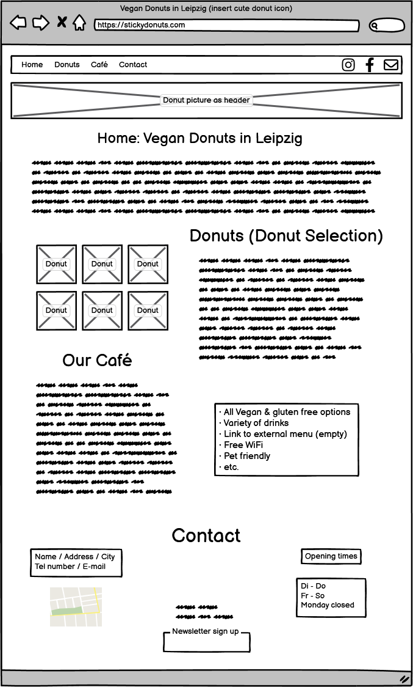
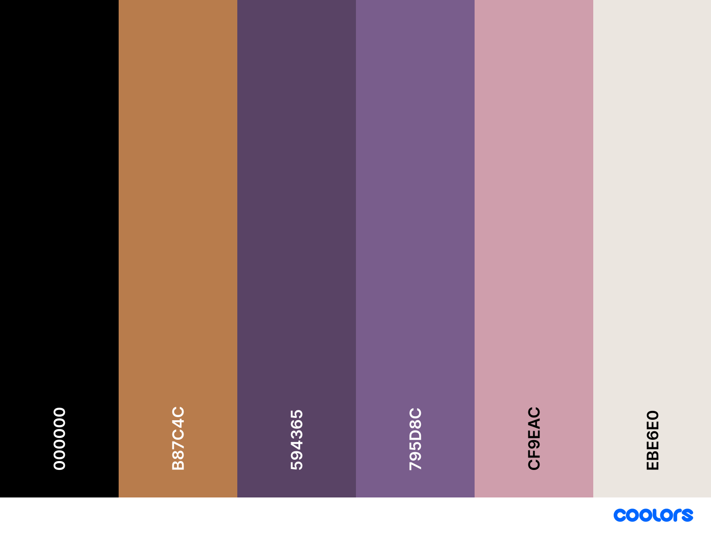

# Code Institute: HTML/CSS Project by Rafaela Wetzel

The first milestone project is about creating a static website and showcasing the HTML/CSS skills I have attained over the past two months at Code Institute. It is the first out of five projects.  

# Sticky Donuts Café Leipzig

Sticky Donuts is a fictional homepage for the first vegan donut café in Leipzig, Germany. Sometimes spending time in other big cities makes me quite envious of the amazing vegan donut places existing elsewhere but not where I live so I decided to create my own (at least virtually) 😄

# Table of Contents

- [Code Institute: HTML/CSS Project by Rafaela Wetzel](#code-institute-htmlcss-project-by-rafaela-wetzel)
- [Sticky Donuts Café Leipzig](#sticky-donuts-café-leipzig)
- [Table of Contents](#table-of-contents)
- [Live Demo](#live-demo)
- [UX](#ux)
  - [User Stories](#user-stories)
  - [Strategy](#strategy)
  - [Scope](#scope)
  - [Structure](#structure)
  - [Skeleton](#skeleton)
    - [Wireframe](#wireframe)
  - [Surface](#surface)
    - [Color Palette](#color-palette)
- [Technologies](#technologies)
- [Features](#features)
  - [Existing Features](#existing-features)
    - [Navigation Bar](#navigation-bar)
    - [Delicious Vegan Donuts in Leipzig Section](#delicious-vegan-donuts-in-leipzig-section)
    - [Our Donuts Section](#our-donuts-section)
    - [Drinks Section](#drinks-section)
    - [The Footer: Contact](#the-footer-contact)
  - [Features Left to Implement](#features-left-to-implement)
- [Testing](#testing)
  - [Validator Testing](#validator-testing)
  - [Lighthouse](#lighthouse)
  - [Bugs & Problems](#bugs--problems)
  - [Unfixed Bugs](#unfixed-bugs)
- [Deployment](#deployment)
- [Credits](#credits)
  - [Tutorials](#tutorials)
  - [Media](#media)
  - [Other](#other)

# Live Demo 

You can see a deployed version of my website [here](https://rafaela-wetzel.github.io/Sticky-Donuts/)

# UX

The purpose of the homepage is to present and advertise the café and its offerings as well as provide necessary information on how to get in touch and find the café to attract customers. The target group is people who...

- follow a plant-based diet 
- enjoy sweet culinary delights
- like to spend time in cozy cafés

I wanted to create a homepage that was simple and beautiful in design, with no distracting or overwhelming elements, accessible and easy to navigate.

### User Stories

## Strategy

## Scope

## Structure

## Skeleton

### Wireframe 



## Surface

### Color Palette  
    
     
<br /><br />     
For the Sticky Donuts homepage I have used 6 different gentle colors chosen individually that blend well with each other. <span style="background-color:#cf9eac; color:#000;"><b>Soft pink (#cf9eac)</b></span> and <span style="background-color:#594365; color:#fff;"><b>dark purple (#594365)</b></span> are the dominating ones that I picked because I think they suit well the playful vibe of a donut café. I have also taken into account to choose colors that have sufficient contrast in relation to each other, see also ➤ Lighthouse
<br /><br />   

# Technologies

- Balsamiq
- HTML & CSS
- Lighthouse
- Dev Tools

# Features 

The homepage presents its information on a single scrolling page with four sections: Home, Our Donuts, Drinks and Contact. Furthermore, it is fully responsive to different screen sizes.

## Existing Features

### Navigation Bar

  - The header includes both the name of the café as well as a navigation bar. It has the function to give a quick overview of the homepages' content making it easy to navigate back and forth. Clicking the individual section titles in the navigation bar will lead the user to the respective content section of the homepage so they do not have to scroll all the way. It also features three social media icons (Facebook, Instagram and TikTok) that open in a new tab when clicked. The nagivation bar is part of the sticky header at the top of the page. It is visible all the time even when a user scrolls down which makes it possible to nagivage back to a respective section without having to scroll all the way to the top. Hovering over the navigation bar elements gives the user a feedback by changing color from white to soft pink so they better see where their cursor currently is.

Nav Bar Picture

### Delicious Vegan Donuts in Leipzig Section

  - The home section includes a concise heading, an introductory text as well as a picture with three delicious looking donuts that catch the users' attention. The purpose is to welcome the user and to give a quick overview:  
  
    * *Where is the café located?* Leipzig-Plagwitz
    * *What can you get there?* Vegan homemade donuts
    * A reference to the donut and drinks section below for more information 

Delicious vegan donuts in Leipzig picture

### Our Donuts Section

  - The second section is called "Our Donuts" and presents the donut variations the café has to offer. To the top left there is a picture of four donuts and to the right of the picture a list of the different donut variations including mention of monthly changing special donuts. The purpose of the picture and list is to show the donut variety and to make the user curious about trying all the different styles. Below this paragraph there is a picture of the current donut of the month to the right side with a text to the left describing its components in detail. This paragraph is meant to highlight and give more detailed information about this special donut which is presented separately in a visual pleasing manner. Towards the end of the section there is additional information targeted at customers who might have certain allergies. This is supposed to convey transparency regarding the ingredients and the message that there potentially is something available for everyone.  

Our Donuts picture

### Drinks Section

  - The third section is called "Drinks" and gives an overview of choices. To the left there are three different categories: Autumn specials, tea and coffee. Each of these include a listing of the different types or flavors. To the right there is a picture of a cappucchino. This section is meant to present the variety of drink choices and let the customer know that there is something available to satisfy the thirst after a sweet donut.  

Drinks section picture

### The Footer: Contact

  - The footer section is called "Contact" and meant to give information about the location and opening times of the café as well as the different ways of getting in touch. At this point the user might be curious about trying some donuts and wants to know how to get there or how to get in touch should there be any questions left unanswered.
  
  - To easier get an idea of where the café is located there is a "Where to find us" heading and an embedded Google map. Below the user will find the address as well as a telephone number and e-mail address. The latter two are both accompanied by a phone and email icon to the left. They are also highlighted with an underline so they stick out from the rest of the text. This visually shows that both elements are clickable - when hovering over them the underline disappears and clicking on them will open new windows, either to the users email program or to a tool enabling direct phone calls. Those two elements should make it easier / more convenient to get in touch.   

  - The next part of the contact section is about the "Opening Times" presented in a table. It is supposed to show when the café can be visited - the table format is used to structure the information in a visual way to be able to recognize the opening times at first glance.

  - The last part of the footer is the "Contact Form" which is supposed to make it easier to get in touch with the café owners. There is a name and e-mail address field as well as a textarea below. Above the textarea it says "We would love to hear from you!" which should encourage the user to write a message. Below those text areas there is a "Send" button that gives feedback by changing color from white to soft pink when hovered over. The message can only be sent if the user has entered information in all text fields, otherwise there is a pop-up window telling the user "Please fill out this field". Should a user enter a non-email address in the email address field the pop-up window says "Please enter an email address". 

Footer picture

## Features Left to Implement

- An integrated menu showing prices
- Small information windows when hovering over the individual donut names showing a dedicated picture and description of donut features; or:
- Showing and describing the single donuts in more detail, possibly with allergens, as a fixed part of the homepage
- A form to make a pre-order for donut boxes to pick up (or maybe even to order from a donut delivery service with an integrated payment system)

# Testing 

In this section, you need to convince the assessor that you have conducted enough testing to legitimately believe that the site works well. Essentially, in this part you will want to go over all of your project’s features and ensure that they all work as intended, with the project providing an easy and straightforward way for the users to achieve their goals.

In addition, you should mention in this section how your project looks and works on different browsers and screen sizes.

## Validator Testing

- HTML
  - No errors were returned when passing through the official [W3C validator](link)
- CSS
  - No errors were found when passing through the official [(Jigsaw) validator](link)

## Lighthouse

- Score  

## Bugs & Problems

- For a while the W3C Markup Validation Service showed an error by pointing to a stray ```</p>``` when there apparently was no starting ```<p>```. I was quite confused because there clearly was a starting ```<p>```. It took a while for me to figure out that the issue was a nested list inside the ```<p>``` tag which is not valid code.

## Unfixed Bugs

- No unfixed bugs.

# Deployment

The Sticky Donuts homepage was deployed through GitHub Pages. 
- From the main project page on GitHub, navigate to *Settings*
- On the left side click on *Pages*
- Choose *Deploy from a branch*
- Set the branch to *main* and */ (root) and click on *Save* 
- After a few moments the live link shows at the top of the page.

It can be found here: https://rafaela-wetzel.github.io/Sticky-Donuts/

# Credits 

## Tutorials 

- How to [center content](https://www.computerhope.com/issues/ch001968.htm) within a table
- How to add [letter spacing](https://www.geeksforgeeks.org/how-to-set-letter-spacing-using-css/)
- How to use [scroll-margin-top](https://www.w3schools.com/cssref/css_pr_scroll-margin-top.php)  
- How to make an [e-mail address clickable](https://www.w3schools.com/tags/tryit.asp?filename=tryhtml_link_mailto)
- How to make a [phone number clickable](https://www.w3schools.com/tags/tryit.asp?filename=tryhtml_link_phoneto)

## Media

- The icon in the tab bar was taken from [Icons8](https://icons8.com/icon/YFWa9iouLqLa/donut)
- The icons in the navigation menu and footer were taken from [Font Awesome](https://fontawesome.com/)
- The donut stock picture was taken from [Unsplash](https://unsplash.com/de/@amr_taha)  
- The cappucchino stock picture was taken from [Unsplash](https://unsplash.com/de/fotos/WdJ_5Txrg7k)  
- Color palette generated with [Coolors](https://coolors.co/)

## Other

- Help and feedback from my mentor Oluwafemi Medale
- README.md structure taken from [Anjalee Kulasinghe](https://github.com/anjalee-kulasinghe/portfolio-project1-cv-website/blob/main/README.md)